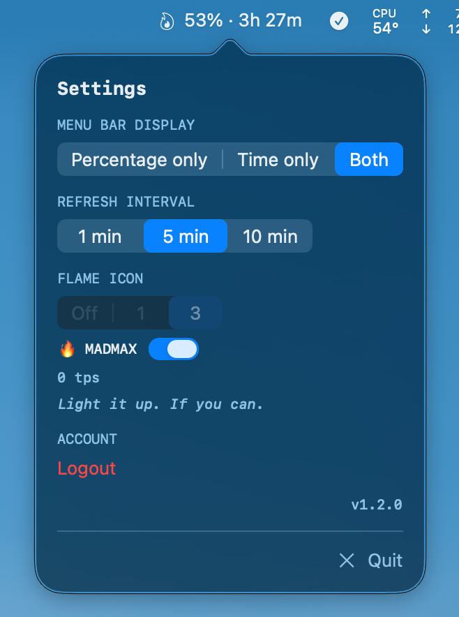

[한국어](README.ko.md)

# Claude Peak

A macOS menu bar app that monitors Claude Max usage limits — with real-time flame animation that burns hotter as you consume more tokens.

## Screenshots

<p align="center">
  
</p>

<p align="center">
  
  
</p>

The menu bar displays the current 5-hour utilization (%) and time until reset. Click to see detailed usage.
When tokens are being consumed, a flame icon animates based on activity level.

## Why Claude Peak?

| | |
|---|---|
| 🔥 **Live flame animation** | The only app that monitors JSONL token logs in real time — flames burn brighter as tps climbs |
| 🎮 **MADMAX mode** | Gamified with challenge messages from *"Pathetic"* to *"WITNESS ME"* |
| 🔐 **One-click OAuth** | No session keys, no DevTools — just login in your browser |
| ⚡ **Pure Swift** | No Electron, zero dependencies, 8 source files via SPM |

## MADMAX Challenge

Enable MADMAX mode and push your token throughput to the limit. Each flame tier unlocks a new challenge message:

| Flames | tps | Message |
|--------|-----|---------|
| 🔥 × 0 | 0 | *Light it up. If you can.* |
| 🔥 × 1–2 | 1 – 19,999 | *That's it? Pathetic.* |
| 🔥 × 3–4 | 20,000 – 39,999 | *Warming up...* |
| 🔥 × 5–6 | 40,000 – 59,999 | *Now we're cooking.* |
| 🔥 × 7–8 | 60,000 – 79,999 | *FEEL THE BURN* |
| 🔥 × 9 | 80,000 – 89,999 | *ONE MORE. DO IT.* |
| 🔥 × 10 | 90,000+ | ***WITNESS ME*** |

> **Can you hit 10 flames?** Most people never get past *"That's it? Pathetic."*

### Flame Modes

Four modes available in settings:

- **Off** — No flame icon
- **1** — Single flame, animates when tokens are active
- **3** (default) — Dynamic 1–3 flames based on tps
- **MADMAX** — Dynamic 1–10 flames (10,000 tps per flame)

<details>
<summary>Dynamic (3) mode — animation speed table</summary>

| tps | Flames | Animation Speed |
|-----|--------|-----------------|
| 0 | (small ember, static) | None |
| 0 – 30,000 | × 1 | 0.50s → 0.20s |
| 30,000 – 60,000 | × 2 | 0.30s → 0.15s |
| 60,000+ | × 3 | 0.20s → 0.08s |

</details>

<details>
<summary>MADMAX mode — animation speed table</summary>

| tps | Flames | Animation Speed |
|-----|--------|-----------------|
| 0 | (small ember, static) | None |
| 1 – 9,999 | × 1 | 0.40s |
| 10,000 – 19,999 | × 2 | ↓ |
| ... | ... | ↓ |
| 90,000+ | × 10 | 0.06s |

</details>

## Features

- **Real-time flame animation** — Monitors `~/.claude/projects/` JSONL logs, animates flames based on token throughput
- **Menu bar display** — 5-hour utilization %, time until reset (configurable)
- **Detailed popover** — 5-hour, 7-day (All models), 7-day (Sonnet) usage + reset timers
- **Settings** — Display format, refresh interval (1/5/10 min), flame mode
- **OAuth PKCE** — Browser-based auth with automatic token refresh

## Installation

### Homebrew (Recommended)

```bash
brew tap letsur-dev/claude-peak https://github.com/letsur-dev/claude-peak.git
brew install claude-peak

# Launch (auto-links to ~/Applications on first run)
claude-peak
```

### Build from Source

```bash
git clone https://github.com/letsur-dev/claude-peak.git
cd claude-peak
./build.sh

# Launch
open ~/Applications/Claude\ Peak.app
```

## Tech Details

<details>
<summary>Auth Flow</summary>

On first launch, click "Login with Claude" → sign in with your Claude account in the browser → tokens are saved automatically.

1. App starts a local HTTP server (random port, IPv6)
2. Opens `claude.ai/oauth/authorize` in browser (with PKCE code_challenge)
3. After authentication, redirects to `http://localhost:PORT/callback?code=xxx`
4. App exchanges the code for tokens at `platform.claude.com/v1/oauth/token`
5. Tokens saved to `~/.config/claude-peak/tokens.json` (0600 permissions)

**Token Refresh:**
- Automatically refreshes 5 minutes before access token expiry
- Prompts re-login on refresh failure

</details>

<details>
<summary>API</summary>

### Usage Query

```
GET https://api.anthropic.com/api/oauth/usage
Headers:
  Authorization: Bearer {access_token}
  anthropic-beta: oauth-2025-04-20
  User-Agent: claude-code/2.0.32
```

Example response:

```json
{
  "five_hour": { "utilization": 2.0, "resets_at": "2026-01-29T09:59:59Z" },
  "seven_day": { "utilization": 63.0, "resets_at": "2026-01-29T23:59:59Z" },
  "seven_day_sonnet": { "utilization": 0.0, "resets_at": null },
  "extra_usage": { "is_enabled": false }
}
```

- `utilization`: 0–100 (percentage)
- `resets_at`: ISO 8601 timestamp or null

### Token Refresh

```
POST https://platform.claude.com/v1/oauth/token
Content-Type: application/json

{
  "grant_type": "refresh_token",
  "refresh_token": "...",
  "client_id": "9d1c250a-e61b-44d9-88ed-5944d1962f5e",
  "scope": "user:profile user:inference"
}
```

</details>

<details>
<summary>Lessons Learned</summary>

- **Keychain token expiration**: Claude Code re-authenticates via browser OAuth each session, which can invalidate Keychain refresh tokens. A standalone OAuth flow is needed.
- **`claude setup-token` limitations**: Issues inference-only tokens (`user:inference` scope only), which cannot access the usage API (requires `user:profile`).
- **OAuth redirect URI**: Must be `http://localhost:PORT/callback` exactly. `127.0.0.1` or `/oauth/callback` paths are rejected.
- **IPv6**: On macOS, `localhost` may resolve to `::1` (IPv6), so an IPv6 socket is required.
- **Token exchange**: The `state` parameter is required for both the authorize and token exchange requests.
- **Utilization values**: The API returns utilization as 0–100 integers (not 0–1 decimals).
- **Field naming**: The API response uses `resets_at` (with plural 's').
- **JSONL token logs**: Claude Code creates per-session JSONL files under `~/.claude/projects/`, with token usage recorded in `message.usage` of each line.

</details>
